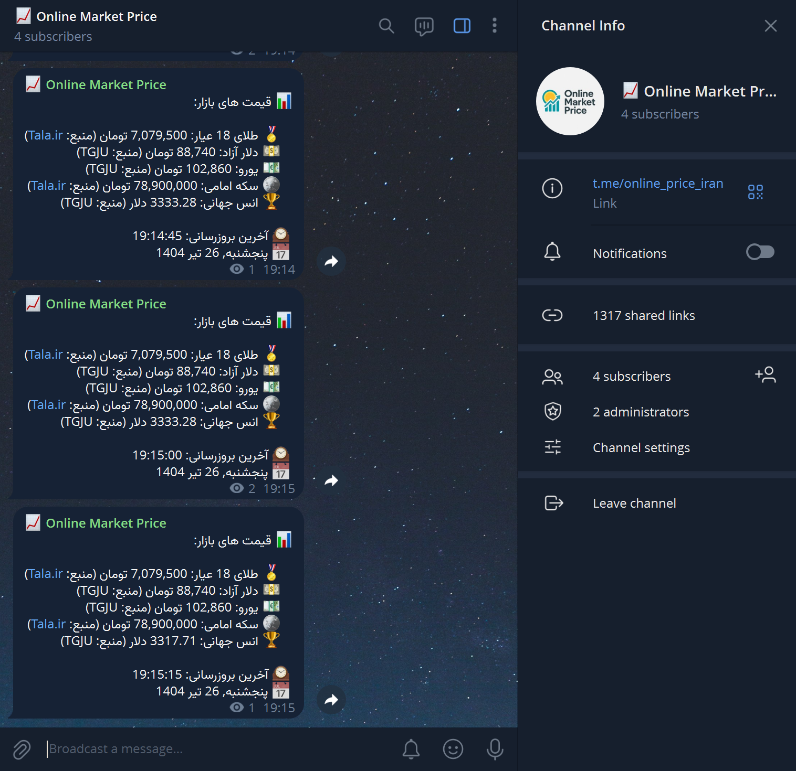
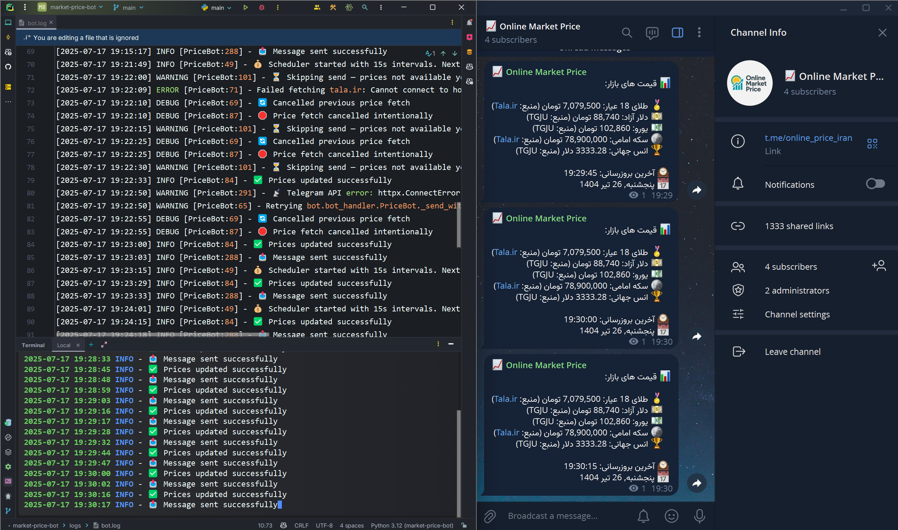

# 📈 Online Market Price Bot (Telegram)

This project is a **real-time price-fetching bot** for Telegram, designed to collect, format, and publish up-to-date prices of currency, gold, and coins in the Iranian market. It uses asynchronous networking (`aiohttp`), scheduling (`APScheduler`), and `aiogram` for seamless communication with Telegram channels.

This bot supports multiple data sources, robust retry logic, beautiful Persian formatting (including Jalali date and emojis), and can operate on a schedule without user intervention.

## ✨ Features

* **Scheduled Price Updates**: Automatically fetches prices and sends them to a Telegram channel at configurable intervals.
* **Asynchronous Scraping**: Uses `aiohttp` for fast, non-blocking network requests.
* **Fallback & Retry Logic**: Smart retry system using `tenacity` to handle failed fetches or timeouts.
* **Multi-Source Support**: Aggregates prices from several sources, falling back when needed.
* **Jalali Date & Persian Locale**: Uses the Persian calendar with full localization and RTL-friendly formatting.
* **Markdown-Based Messaging**: Uses Telegram's MarkdownV2 for styled, readable price messages.
* **Emoji Indicators**: Each price item includes intuitive icons (e.g., 💵, 🪙, 🏅).
* **Anti-Blocking Strategies**: Uses randomized delays and rotating user-agent headers to simulate human behavior and reduce the risk of getting blocked by source websites.
* **Logging & Debugging**: Colorized terminal logs + rotating file logs with detailed error messages.


## 🧰 Technologies and Libraries Used

* **Python 3.10+**
* **aiogram** – Telegram bot framework (async)
* **aiohttp** – Asynchronous HTTP client
* **APScheduler** – Job scheduler for recurring tasks
* **BeautifulSoup4** – HTML parsing and data extraction
* **Jalali** – Persian calendar formatting
* **tenacity** – Retry utility for network robustness
* **python-dotenv** – Environment configuration
* **colorlog** – Colorized logging output


## ⚙️ How It Works

1. **Bot Initialization**
   Loads config, initializes the Telegram bot, reads user-agent list, and sets up the scheduler.

2. **Scheduled Task Execution**
   APScheduler triggers the price-fetch job every X minutes (based on config).

3. **Fetching Data**
   Each asset (USD, gold, Euro, coin, etc.) is fetched from its assigned sources. Data is parsed and formatted with fallback support.

4. **Formatting**
   Prices are formatted with currency symbols, emojis, digit separators, and Jalali date-time.

5. **Sending to Telegram**
   The message is published to a specified Telegram channel using aiogram’s `send_message`.

6. **Logging**
   Logs are written to both console (colorized) and a rotating log file under `/logs`.


## 🚀 Setup and Usage

### Prerequisites

* Python 3.10+
* Telegram Bot Token and Channel ID
* Optional: Redis (if planning future enhancements)

### Installation

1. **Clone the Repository**

   ```bash
   git clone https://github.com/SMR-H/market-price-bot.git
   cd market-price-bot
   ```

2. **Create a Virtual Environment**

   ```bash
   python -m venv venv
   source venv/bin/activate  # On Windows: venv\Scripts\activate
   ```

3. **Install Dependencies**

   ```bash
   pip install -r requirements.txt
   ```

4. **Configure Environment Variables**

   Create a `.env` file:

   ```env
   TELEGRAM_TOKEN=your_bot_token
   CHANNEL_ID=@your_channel_username
   ADMIN_CHAT_ID=your_user_id
   ```

5. **Run the Bot**

   ```bash
   python main.py
   ```

## 🗂️ Project Structure


```
market-price-bot/
├── bot/
│   ├── bot_handler.py         # Main logic to fetch and send price messages
│   └── scheduler.py           # Schedules periodic tasks with APScheduler
│
├── config/
│   ├── settings.py            # App settings, constants, env loader
│   └── logging_config.py      # Logging setup with rotation and formatting
│
├── core/
│   └── price_fetcher.py       # Functions to scrape and parse price data
│
├── data/
│   └── user_agents.txt        # List of rotating user agents for HTTP requests
│
├── logs/
│   └── bot.log                # Log output (rotating)
├── .env                       # Environment variables
├── main.py                    # Entry point: sets up the bot and scheduler
└── requirements.txt           # Python dependencies
```


## 📸 Screenshots

### 📤 Telegram Channel Output  
Final formatted message sent to the Telegram channel (includes emojis, Jalali date, and Persian content):




### 🧠 Logging System  
Shows how the bot updates prices, manages scheduler intervals, skips empty fetches, and handles messaging reliability:




## 💡 Use Cases

* Automatic price reporting for:

  * Telegram channels
  * Financial dashboards
  * Local business tools
* Replaces manual price tracking by admins.
* Easily extendable to crypto or fuel prices.


## ⚡ Localization & Jalali Support

The bot fully supports Persian (Farsi):

* Jalali date and time using `jdatetime`
* Persian digit conversion (`۳۴۵۰۰۰۰`)
* Emojis for visual clarity
* RTL-friendly formatting for message blocks

## 🛡️ Reliability & Logging

* 📁 Logs are written to `logs/bot.log`
* 💡 Each error is categorized (parsing, network, template, etc.)
* ⏳ Retry mechanism with `tenacity` ensures network robustness


## 🏁 Production Tips

* Run with **supervisor** or **systemd** to keep it alive.
* Use **Docker** for portable deployments (optional).
* Monitor logs regularly in `logs/bot.log`.
* Consider adding proxy rotation for heavy usage.


## 📄 License

This project is licensed under the **MIT License**. See the [LICENSE](LICENSE) file for details.
Feel free to use, fork, and improve it for your own needs.

## 🤝 Contributions

Pull requests and issues are welcome. For major changes, please open an issue first to discuss what you'd like to change.